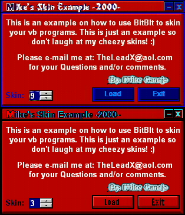



## Mike's Skin Example v1\.0

### Description

This is a decent example on how to skin a form. I made 10 skins and Commented every line in this project so you can see what's going on and how BitBlt works from top to bottom. If you don't know BitBlt that well or at all, this is a perfect example for you. Please RATE this and soon I'll make a v2.0 of this. And if you make a good skin for this,  E-mail me it at: mikecanejo@hotmail.com! :)
 
### More Info
 

             |
---                |---
**Submitted On**   |2000-04-15 12:33:02
**By**             |[Michael L\. Canejo](https://github.com/Planet-Source-Code/PSCIndex/blob/master/ByAuthor/michael-l-canejo.md)
**Level**          |Intermediate
**User Rating**    |3.6 (155 globes from 43 users)
**Compatibility**  |VB 5\.0, VB 6\.0
**Category**       |[Custom Controls/ Forms/  Menus](https://github.com/Planet-Source-Code/PSCIndex/blob/master/ByCategory/custom-controls-forms-menus__1-4.md)
**World**          |[Visual Basic](https://github.com/Planet-Source-Code/PSCIndex/blob/master/ByWorld/visual-basic.md)
**Archive File**   |[CODE\_UPLOAD48634162000\.zip](https://github.com/Planet-Source-Code/michael-l-canejo-mike-s-skin-example-v1-0__1-7301/archive/master.zip)

